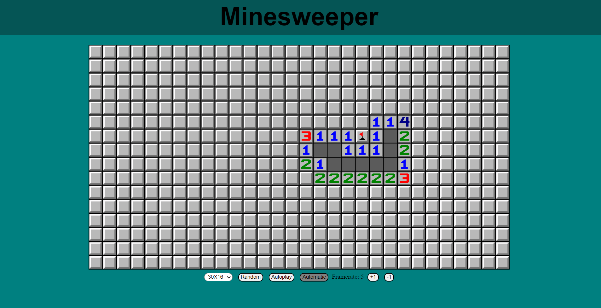

# Minesweeper
## Minesweeper Game in Javascript with Autoplay Bot

### About this project

This is a simple implementation of the classic Minesweeper game in Javascript. It includes a bot that can play one turn at a time and
an option to let it play automatically. The bot speed can be adjusted with the framerate buttons.  
When you finish a game, or when you get tired, you can click the "Ranom" button to generate a new game.

 
<strong>Creation Date</strong>: 2021-05
 
<strong>Author</strong>: Sergio Herreros
